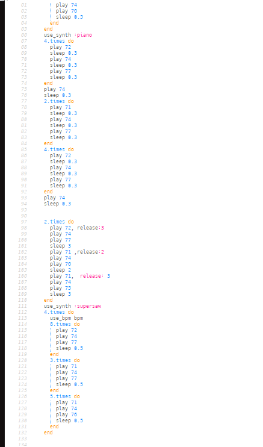
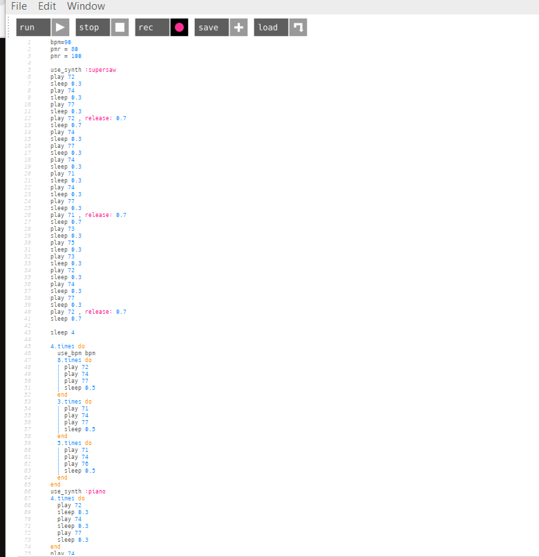

## پروژه سونیک من 
به نام خدا <
 
درابتدا که شروع به زدن پروژه کردم تصمیم گرفتم از آهنگ به خصوصی کمک بگیرم منتها آن موسیقی را هنوز پیدا نکرده بودم  
بعد از کمکی موسیقی زدن متوجه شدم که میتوان از یکی  از اهنگ های اسنوپ داگ بهره گرفت پس من ابتدا در گوگل سرچ کرده و کرد های ان را پیدا کردم 
سپس آنها را درون سونیک پای خود پیاده سازی کردم 
 
بعد از آن نوبت به انتخاب ساز مورد علاقه شد و به طبع من پیانو را انتخاب کردم سپس نت هارا دانه به دانه شماره آنهارا درون سونیک نوشتم و کم کم موسیقی من شکل گرفت
 
نکته کار اینجا استفاده از چند کلاویه به صورت همزمان بود که تجلی بخش موسیقی من بود حتی بعد از آن استفاده از ریلیز و اسلیپ بود که به نت ها فرم میداد  
بعد از آن نوبت استفاده از لوپ بود ولی بعد از ان من ازین کار منصرف شدم زیرا نمیخواستم تا اخر موسیقی این لوپ تکرار شود. سپس رو به کاربرد سمپل آوردم زیرا فکر میکردم این کار موسیقی من را بهتر میکند ولی بعد ان ازین کار هم پشیمان شدم زیرا سمپلی که بتواند با نت های من فیت شود خیلی سخت بود ساختنش 
 
در آخر از ساز بهتری استفاده کردم که باعث شد موسیقی صدای بهتری داشته باشد در واقع این کار را با مشورت اقای عمویی انجام دادم 
چیزی که مشهود است اینست که آخر پروژه من از نت های بلند تر استفاده کردم که رهنمای پایان موسیقی بود 
 
سرانجام امیدوارم که از اولین تجربه موسیقی من نهایت لذت را برده باشید .
 

[my project](https://soundcloud.com/alireza-eslamikhah/mymusic)

 

<audio controls>
    <source src = "../assets/music/mymusic.mp3" type = "audio/mp3">
</audio>
 

 

---
**Test**: This is atest
